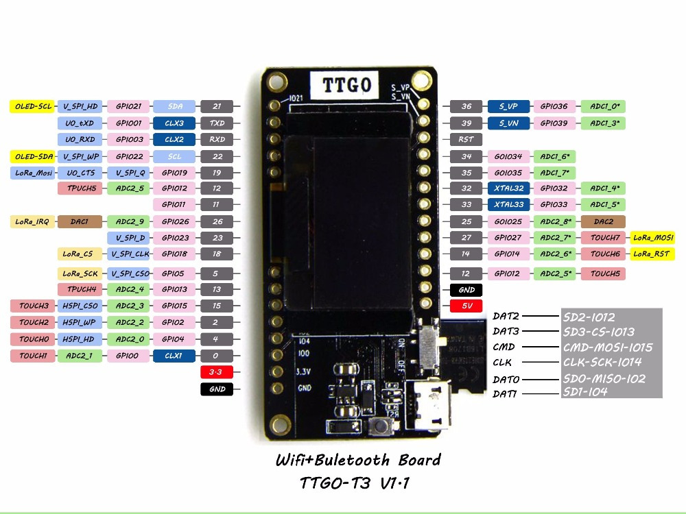
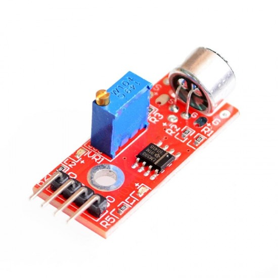

# ESP32-based Audio Recorder

Sample sound from the ESP32 ADC and record to wav files on an SD card.

For the example we use the TTGO LoRa32 board in combination with an electret microphone. The LoRa32 board offers an SD card slot, which is helpful to minimize cabling.



As analog input signal we use a Sparkfun Electret Microphone, which includes an amplifier and a gain meter.



The microphone is connected to `GND`, `5V` and the `ADC1_0` channel on `GPIO36`. The gain needs to be tuned manually, to reach a medium level in a silent environment. 

## Basics

### High Analog Sampling Rates

Following the [datasheet of the ESP32](https://www.espressif.com/sites/default/files/documentation/esp32_datasheet_en.pdf) the internal Analog-Digital-Converter (ADC) is able to sample with up to 2 Msps with the DIG controller and 200 ksps using the RTC controller. 

To enable this high sampling rates, the real time functionality of the ESP IoT Development Framework (ESP-IDF) must be used. Also, the lower level functions of the ESP should be used, instead of relying on the higher-level Arduino features. The respective [`adc1_get_raw()`](https://docs.espressif.com/projects/esp-idf/en/latest/api-reference/peripherals/adc.html#_CPPv412adc1_get_raw14adc1_channel_t) function can be used here.

The timing can be achieved by using the internal timers, which are configured by a 16-bit pre scaler and a 64-bit counter value. A timer fires, when the counter is reached, which is incremented based on the clock speed divided by the internal clock speed. The minimum pre scaler value is 2, which results in a 40 MHz maximum rate with the 80 MHz clock. 

```
// start timer 3, pre scaler 80 -> 1 MHz, increment mode
adcTimer = timerBegin(3, 80, true);
```

The timer can be attached to a function to be called. The function call from an interrupt has to be finished until the next timer fires, so only small operations can can be executed there. In our case the data is written to a local buffer.

```
// call onTimer() when adcTimer fires
timerAttachInterrupt(adcTimer, &onTimer, true);

// add a counter of 50 (20.000 samples / 1 MHz), repeat mode
timerAlarmWrite(adcTimer, 50, true);
timerAlarmEnable(adcTimer);
```

### Handling data 

The timer function can notify a task to write the buffered data, in our case when the buffer is filled. The `ulTaskNotifyTake()` function of the ESP-IDF is simple way of receiving a message inside a function. It blocks until a message is received. In the `writeWav()` function we write the buffer to the SD card, whenever the notification is received. Since the writing function needs to be faster than the sampling anyway, we do **not** check for buffer underruns here. 


## Possible Improvements

- [ ] Read ADC directly in timer function
- [ ] Write data block wise
- [ ] Trigger recording on audio signals


## Notable Mentions 

- "[Working with ESP32 Audio Sampling](https://www.toptal.com/embedded/esp32-audio-sampling)", *Ivan Voras*
